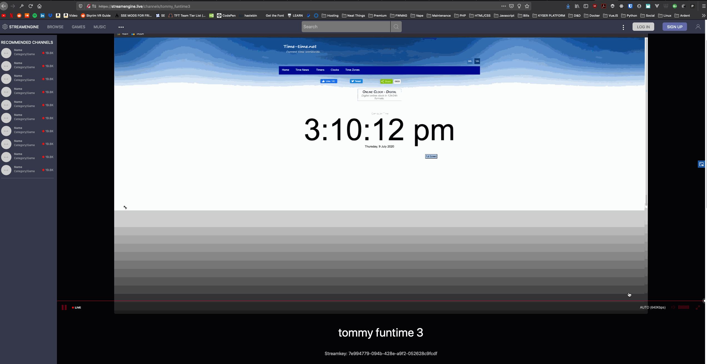

# StreamEngine

## About
StreamEngine is a live streaming app that simply described will be like a white label twitch.tv that can be used either as a personal streaming site or for communities or businesses that want to have a more curated and exclusive streamer base.

This project is in the very early stages of development, and lots more info will be added in the coming days as more progress and planning is done.

Early version of the desktop homepage, done with plain old html/css vanilla js and UIkit.
I'll add a demo link when it's ready.

Adaptive Bitrate HLS player and stream example.

## This Repo

This repo will be about deployment and usage of StreamEngine.

Since StreamEngine is broken up (or will be..) into parts, I've decided to split up the repos for each part.

Here I plan to include only the methods with which you can deploy the app, i.e. docker-compose, ansible, etc.

## The Parts

Obviously a twitch scale app is gonna involve alot of moving pieces, so I'm sure this list will grow with development.

- [ ] UI (web app) repo: https://github.com/r-t-k/StreamEngine-UI
- [ ] API (connects everything and handles the DB)
- [ ] User Admin (For the management of an app instance and its community)
- [ ] Stream Backend repos: https://github.com/r-t-k/StreamEngine-srs-origin | https://github.com/r-t-k/StreamEngine-srs-hls-transcode

## The Tech

The stack may change abit early on in development, but right now I have a solid idea of what I want the architecture to be

- UI: Either Django with Vue/React or just Vue/React, framework choices depend on the help I get
- API: Django Rest Framework
- User Admin: TBD
- Stream Backend: OSSRS (https://github.com/ossrs/srs/)

## The Status

Right now I'm working on a proof of concept, so the plan to split the parts up might come later, for now the web app comprises the UI, Admin, and API as a Django monolith.

## The Open Source Part

The core, which is everything described above will be open source under MIT. The not open source part will be the SaaS portion of this project which will be a private project. Basically I intend to offer a managed version of this to businesses with added features around monetization and UI themeing, that's it. 

## The Discord
 
https://discord.gg/nUaBR56

